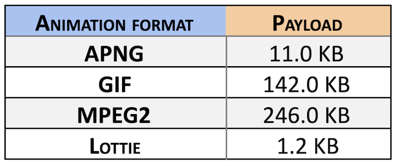
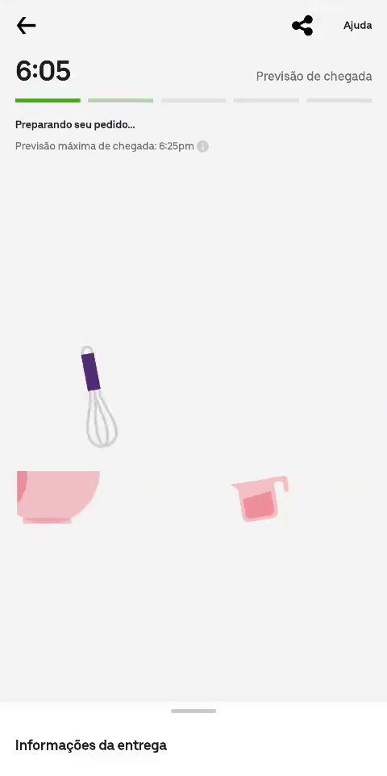

# Café com Código Lottie 🖼

---

# Prazer, Humano 👽
### Dev Mobile Híbrido - Jetsons
###### Gosto de Cubo Mágico
###### Curto Jogos de Tabuleiro
###### Sei ler e escrever em morse

---

# O que é Lottie?
#### "A Lottie is a JSON-based animation file format that enables designers to ship animations on any platform as easily as shipping static assets. They are small files that work on any device and can scale up or down without pixelation."

---

## Comparação 📈

---

## Quando usar? 🤔

---

### Case rebranding 👔

---

### Loading

---

# Aplicações Premium 🚀
#### Diferencial
#### Engajamento

---

# Beleza, então bora
### 📱Suporte a muitas plataformas 💻
#### Web, iOS, Android, Windows, QT, Tizen
###### Lottie libraries and plugins available for Web, iOS, Android, Flutter, React, React Native, Xamarin, NativeScript, Windows, Vue, Angular, QT, Skia, Framer X, Sketch, Figma & After Effects.

---

## Código 🖥️

---

References:
---
- [Lottie Files](https://lottiefiles.com/recent)
- [Lottie for RN](https://github.com/react-native-community/lottie-react-native)
- [What is Lottie](https://lottiefiles.com/what-is-lottie)